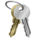
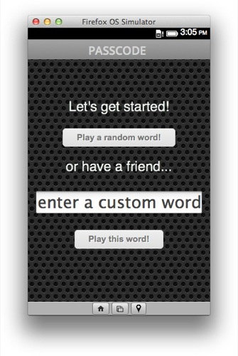
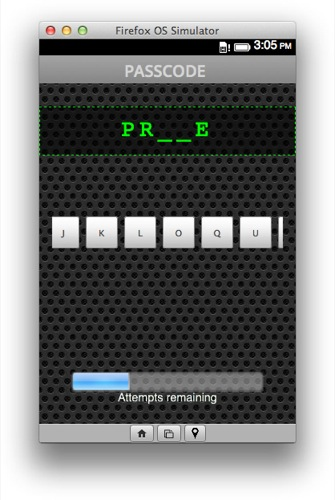
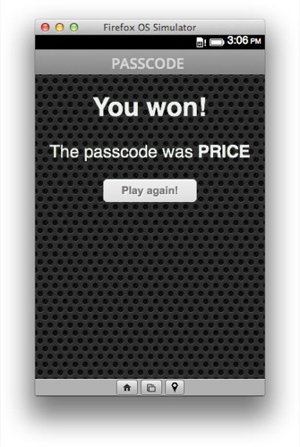

# Passcode

A variant of the well-known game "hangman".

## Screenshots

## Acknowledgments

Thanks:

* to *subtlepatterns* for the [background pattern](http://subtlepatterns.com/bo-play/) (CC by-nc-sa).
* to Charles Kay Ogden for his [basic words list](http://en.wikipedia.org/wiki/Basic_English).

## License

This program is free software; it is distributed under an
[MIT License](./LICENSE.txt).

---

Copyright (c) 2013 Fred Wenzel.
